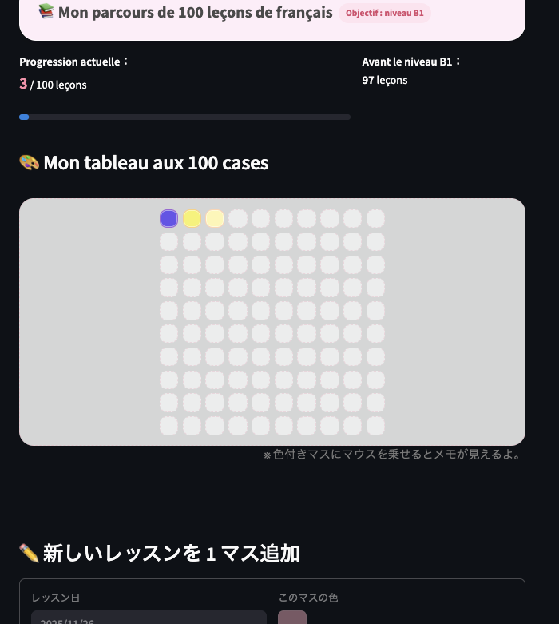

# 🎯 Mon parcours jusqu’au niveau B1

Une application simple et visuelle pour suivre **100 leçons de français**
à votre propre rythme — sans pression, juste de la progression.

---

## ✅ Fonctionnalités

- Chaque leçon = **1 case remplie**
- Objectif final : **100 cases = niveau B1**
- Possibilité d’ajouter :
  - le nom du professeur
  - une couleur personnalisée
  - une petite note
- Interface douce et motivante

---

## 📸 Aperçu



---

## 🚀 Installation

### 1. Cloner le projet
```bash
git clone https://github.com/USERNAME/NOM-DU-REPO.git
cd NOM-DU-REPO
